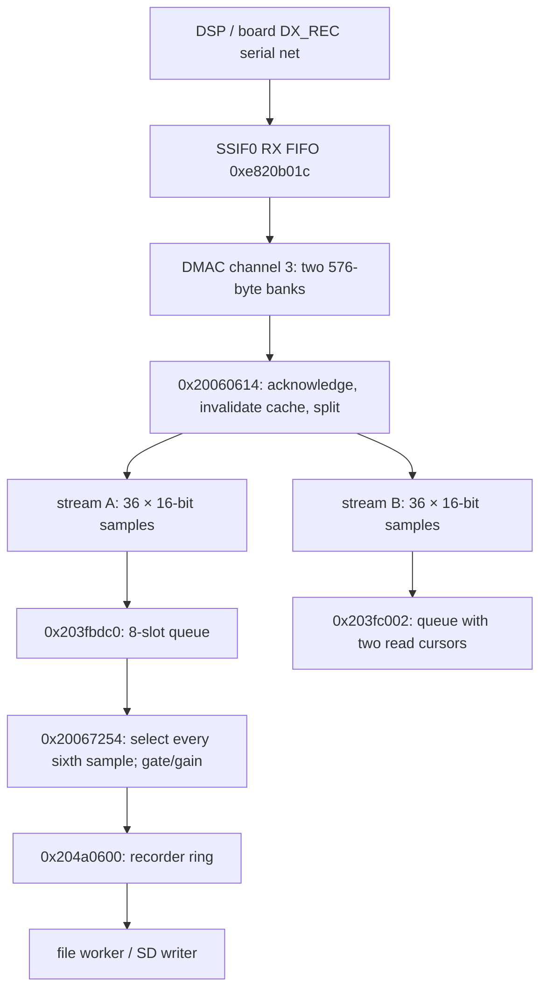

# Native receive data path, original IC-7300 v1.42

The lead at `0x2006bfd4` reads a **stored file**. Following the separate recorder
producer upstream identifies a live SSIF0 receive DMA path, two software sample
queues and a recorder ring. This interface map now has a [timestamped target capture](native-receive-target-capture.md)
confirming the recorder relationship and cadence in USB-D. It is not a callable
extension API; gain/control dependence and lifecycle requirements keep #15 open.

## Scope and reproduction

All code addresses below refer to the decoded original v1.42 application,
SHA-256 `4686728c9d1f7249b6278a29686a40b8fa5e527bd2428a76a33cd9395178c9a4`.
The original container is pinned in `research/targets.json`. The display-only and later receive-diagnostic candidates have different application
hashes and are deliberately not accepted by this original-instruction probe. No radio connection or firmware construction is involved.

```
.venv/bin/python tools/native_receive.py artifacts/original/7300_142.dat \
  --output artifacts/native-receive/report.json
IC7300_TEST_IMAGE=artifacts/original/7300_142.dat \
  .venv/bin/python -m unittest discover -s tests -p test_native_receive.py -v
```

The report includes image/application/tool hashes, source revision, pinned
Capstone/Unicorn versions, bounded static flows and original-instruction trials.
Input/source mutation invalidates the report. Existing output is not overwritten.
Synthetic fixtures replace RAM contents, not original copy/clear helpers.
Execution, memory accesses and instruction count are bounded. DMA extraction
starts **after** cache maintenance with a supplied selected-bank pointer; neither
physical DMA nor cache coherency is emulated. Firmware bytes and disassembly stay
in ignored local artifacts.

Hardware interpretation uses Renesas's [RZ/A1H hardware manual](https://www.renesas.com/en/doc/products/mpumcu/doc/rz/r01uh0403ej0400_rz_a1h.pdf)
(the downloaded document identifies itself as R01UH0403EJ0700 Rev.7.00,
September 30, 2024 despite the URL's older suffix; SHA-256
`8a84a7149f95e50be2020e3d0966aa6a130afd7636a6ee5c219b22f80831d4ca`),
chapters 9, 10 and 19;
and the Icom-authored [service manual](https://www.rigpix.com/icom/ic7300_service.pdf),
main-board schematic PDF page 64 and block diagram page 60. Those documents
identify peripheral registers and board nets; they do not establish the behavior
of every fitted radio revision or measure its clocks.

## File command versus live path

`0x2006bddc` posts a buffer/count-pointer pair in `0x20390444+0x40/+0x44`,
sets command byte `+5` to 6, and signals the object at `+0x28`.
Worker `0x2006c2c4` dispatches command 6 to `0x2006bfd4`, which calls
`0x2006bc84`, then the existing file reader `0x200bc6a4`. Length accounting,
EOF and error fields belong to file playback. Caller `0x2004ab14` supplies
`0x2049e600` and a maximum request of 8192 bytes. None is a capture timestamp.

The recorder uses a different worker, `0x2006bb58`, and signal object `+0x24`.
Submit routine `0x2006a354` sets command `+4=4` and buffer/length `+0x50/+0x54`;
its worker calls `0x2006b6d8`, then `0x2006a1a4` and file writer `0x200bc6fc`.
This separation matters: calling the original file reader would not provide a
live receive subscription.



The DX_REC name belongs to the physical serial wire, which carries both extracted
streams. The earlier DR_AF label here was incorrect: the service schematic
(PDF page 64) connects DX_REC to CPU pin 190, P2_10, and DR_AF to pin 191,
P2_11. The Renesas hardware manual's pin table (PDF page 94, printed 1-32)
identifies function 4 on these pins as SSIRxD0 and SSITxD0 respectively.
The DSP schematic (service PDF page 66) connects DX_REC through R924 to
DSP pin 116; DR_AF connects to pin 117. This is a schematic connection,
not a measurement of every fitted board revision. The net name does not by
itself identify stream A/B as receive/transmit or prove pre/post-AF gain placement.

Private DSP configuration analysis places pin 116 on transmit serializer 4.
The conditional output-transfer model associates that serializer with context
offsets 384 and 416, whose reviewed conversion suffix repeats adjacent samples.
That repetition is compatible with native samples having no adjacent duplicates:
the CPU extraction below drops alternate stereo frames. Original extraction
tested with repeated synthetic frames yields distinct samples for both pair
phases and both channel orders. Thus absence of duplicates in native A cannot
exclude this DSP source without accounting for CPU decimation. Transfer/FIFO
ordering, frame polarity and full producer behavior still require qualification.

## Format, DMA and buffer ownership

| Boundary | Exact observed behavior | Consequence |
| --- | --- | --- |
| Setup `0x2005ff1c` | DMAC3 source `0xe820b01c`; banks `0x203faf40`, `0x203fb180`; each transfer 576 bytes; config `0x61122263` | These are existing hardware-owned buffers, not free RAM. |
| SSIF0 setup/start | Control at `0xe820b000` moves from `0x002b0030` to `0x3c2b0033`; FIFO status `+0x14` is cleared | Control fields specify 24-bit data, 32-bit system words, left-aligned parallel data and external bit/word clocks. `+0x14` is SSIFSR, not a mode register; SSITDMR is at `+0x20` and is not written by these reviewed setup stores. Normal two-channel mode requires its reset/default state or other initialization to be qualified. |
| DMA handler `0x20060614` | CHSTAT3 bit 0 absent restarts audio; bit 6 absent returns; bit 7 chooses completed bank (set: first, clear: second) | Selection depends on live DMA status; an address alone is not permission to read a stable bank. |
| Coherency | Acknowledges status/rearms, invalidates eighteen 32-byte cache lines with a barrier for each | A future hook must respect this ordering and finish before the bank is reused. |
| Extraction `0x20060690..0x200606d4` | For `i=0..35`, retains upper 16 bits of words at bank offsets `16*i` and `16*i+4`; ignores words `+8/+12` | Two planar 72-byte arrays at `0x203fc48a` and `0x203fc4d2`; under normal two-channel framing this omits every other stereo frame. The low eight valid bits of each 24-bit word are discarded. |
| First queue | Base `0x203fbdc0`, eight 72-byte slots; producer byte `+0x240`, consumer byte `+0x241` | Original producer/consumer own these cursors. A new consumer cannot share/advance them. |
| Second queue | Base `0x203fc002`, eight 72-byte slots; producer `+0x240`, read cursors `+0x241/+0x242` | Both cursors have consumers: recording and peak metering; see the [ownership follow-up](native-receive-memory.md). |
| Recorder publication | `0x20066f18`: 1914 slots of 220 bytes at `0x204a0600`; 216-byte payload at slot+4; producer halfword `0x205072da`, consumer `0x205072d8` | Metadata/recording gates make this unsuitable as an assumed uninterrupted PCM feed. |

The 16-bit samples are stored little-endian; downstream arithmetic treats them
as signed. Extraction and sample selection preserve their bit patterns, including
negative values. They provide no calibrated relationship to RF level.

All 64 first-queue index pairs were tested for count, push and pop using original
instructions. Count is `(write-read) mod 8`; empty pop zeroes 72 output bytes.
Push advances modulo eight **without checking capacity**. A push when seven slots
are pending makes write equal read, hiding the pending backlog as empty. Neither
zero samples nor modulo indices suffice to detect all loss.

Publication tests cover normal/wrapped indices with recording enabled/disabled.
Enabled publication copies all 216 bytes, sets metadata bytes 1 and 2, advances
the producer, and zeroes the following 220-byte slot. Disabled publication still
resets scratch fill to zero. There is no consumer-capacity test in this routine.
Mode-change helper `0x200685f0` can flush a nonempty partial scratch block through
the same full-size publisher while interrupts are masked. Valid-length and
transition semantics must not be inferred from payload size alone.

## Rates and gain

The original recording format writer `0x20069008`, reached from recorder file
creation at `0x2006ae5c`, writes mono PCM16, 8000 samples/s, 16000 bytes/s and
2-byte alignment. This is tested by executing the writer and its original helpers.
The first-queue consumer chooses six of each 36 input samples, then accumulates
108 samples (216 bytes) for publication. Combining these facts supports an
**intended nominal 48 ksample/s first-queue stream**, and 96 k stereo frames/s at
SSIF0 before alternate-frame omission. The recording contract originally supplied this inference. The first target
capture now also supports approximately 48 kHz at the extraction boundary,
relative to the recovered timer scale; the wire-clock rate is still inferred. A changing route, stalled queue or wrong external
clock invalidates a naive sample-count-to-time conversion.

No filter appears in the isolated selection routine `0x20066fc4`; modes 0..4 use
strides 6, 4, 3, 2 and 1. Upstream filtering is a DSP question. Do not reuse this
sample picker as a demonstrated anti-alias resampler for FT8.

`0x20067254` applies route/mute decisions after selection. One branch scales by
181/256 (signed truncation toward zero); another emits zeros through `0x20066ed0`.
The [recorder-control follow-up](native-recorder-controls.md) executes these
branches and maps TX REC Audio and RX REC Condition to their settings records.
The DMA extraction point precedes these **CPU recorder** operations, but DSP
AGC, squelch, AF volume and mode effects on the incoming wire remain unresolved.
Therefore it is a better investigation point, not yet an invariant gain tap.

## Lifecycle, execution context and timestamps

- Startup calls `0x2005fac4` to zero the first queue cursors.
  `0x2005fad8` flushes it by moving read to write; this loses samples without
  a timestamp or gap marker. `0x200605fc` initializes DMA-bank memory, configures SSI/pins and DMA, then
  starts the audio transport at `0x2006003c`. `0x200605e4` disables and restarts
  transport on the observed failure path. It does not call the initial bank
  clear. A restart must invalidate an adapter's continuity epoch. The
  [lifecycle follow-up](native-receive-lifecycle.md) establishes that all three
  serviced DMA channels can request the same transport restart; A-queue flushing
  is a separate consumer operation. The complete original start/stop probes also
  show that a timeout need not clear an old start gate, while stop does not
  check DMA inactivity. Neither a return nor a service flag transfers ownership
  of the native DMA buffers to a new consumer.
- `0x20005c08` registers `0x20005b98` for interrupt ID `0x9a`. This service
  checks the flag at `0x2039038c`, calls the DMA handler, and advances the MTU2
  channel-3 compare at `0xfcff0218` by 8000 timer ticks. Those ticks are not
  audio samples and are not UTC. The [timing follow-up](native-receive-timing.md) establishes the intended
  32 MHz scale and 250-us service spacing; actual frequency, continuity and
  worst-case service latency remain unmeasured.
- Recorder consumption is reached via `0x2006759c` in the main service loop
  (`0x2002b620`) and other paths. File I/O runs in separately created workers.
  Task descriptors at `0x201988cc/0x201988dc` identify those worker entries;
  descriptor priority/stack semantics still need RTOS analysis.
- `0x2006756c` resets recorder state, `0x200686a4` controls ring publication,
  and `0x200685f0` handles recording tag changes. These are recorder lifecycle
  operations, not an independent capture enable/disable API.
- No per-block acquisition timestamp was found in the two sample queues or in
  the described ring fields. `0x2039041c+0xc` is a resettable counter, not proof
  of UTC or a continuous sample clock. A callback-time timestamp also includes
  buffering and interrupt latency; it is not automatically the first sample time.

## Bounded adapter contract and remaining work

The promising observation boundary is **after extraction/cache maintenance and
before the queue pushes** at `0x200606d4`. A prospective adapter copies samples;
it never changes original cursors, DMA registers, buffer ownership, recorder
state, or the returned register/stack state. Decoder, filesystem and UI work
must remain outside this interrupt path. Storage requires an owned region or
verified allocation context; the [memory study](native-receive-memory.md) maps
a shared allocator and padding candidate, but does not reserve either for capture.

A diagnostic block needs a version, continuity epoch, monotonically increasing
sequence/sample index, raw timer observation, timer frequency/epoch validity,
channel identity, sample count, format, explicit loss/restart flags and data.
UTC association belongs to a separately verified timer/RTC mapping. Stop/restart,
unknown channel/rate, sequence gaps and buffer overrun must invalidate the affected
capture rather than silently fabricate continuity. A private adapter queue needs
bounded capacity and an explicit overflow policy; the native modulo queue cannot
supply that accounting retroactively.

Completion requirements and current status:

1. Resolve channel A/B meaning and mode/gain controls across RX/TX, squelch and
   AF volume; follow the DSP control path and compare CPU consumers. Nominal
   sample rate is not sufficient channel identification.
2. Complete the [timing follow-up](native-receive-timing.md): nominal clock
   scale and register rollover are mapped, but a coherent monotonic capture
   epoch and DMA restart/loss association are not. Link UTC separately under #17.
3. Identify an owned bounded buffer, execution/ABI insertion mechanism and export
   path; establish interrupt/task budgets under #14. Do not choose an apparent
   zero-filled region as free memory.
4. DONE for the first bounded diagnostic: the exact receive-only candidate was
   prepared and footprint-validated, separately approved, and installed by the
   owner. It adds no PTT operation. Further modifications are separate work.
5. The first timestamped target capture is complete: stream A matches ordinary
   receive recording at unity gain, bank alternation and nominal cadence pass,
   and the owner reports normal restart/reception. Gain/control variations and
   restart/loss association remain required; the bounded record does not prove
   all of these properties. See the [target evidence](native-receive-target-capture.md).

The investigation plan is [NATIVE_RECEIVE_PLAN.md](../docs/NATIVE_RECEIVE_PLAN.md).
